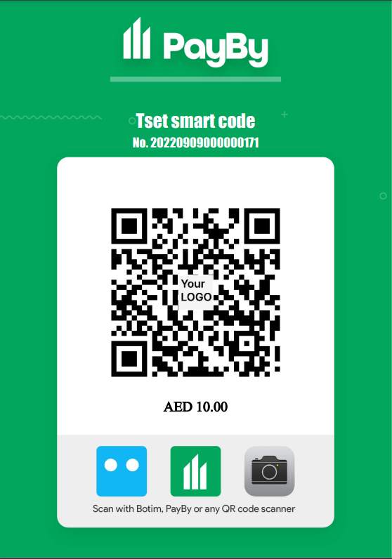

# Smart code

Set the amount to generate a QR code. You can download from PayBy protal and print it and place the materiel in your store where customers can see it. The customer can scan the code by any scanner APP or PayBy to complete the payment.

 

Here is a sample, please use the PayBy app of test environment version to scan the code and experience the payment process. Find the apk and account [here](/demos/testaccount).

 

 

**Step 1**: Use PayBy app of test environment to scan the code above ( Unable to scan code with camera in test environment). Find the apk and account [here](/demos/testaccount).

 

**Step 2**: You will be redirected to built-in checkout. Enter the password and complete the payment.

 

