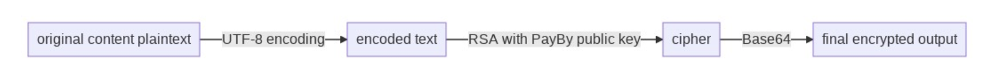

import RequestHeader from '../_request-header.mdx'

# Authentication

### Sign the request

The preferred signature algorithm is SHA256withRSA, an efficient asymmetric encryption method. This algorithm first calculates a unique hash of the input data using SHA256 algorithm. The hash is then encrypted with a private key using the RSA algorithm.

Merchants would need to generate a pair of private key and public key from OPENSSL. Once the key pair is generated, the merchant's public key needs be shared with PayBy so that the sent messages can be validated by PayBy. So should they obtain PayBy's public key for furture use cases.

When the merchant is ready to send the API request, they should sign the request message with the merchant's private key.

When encryption is needed per API requirement, the merchant should encrypt the message with PayBy's public key so that PayBy can decrypt with their private key.

In order that all messages to be properly verified and decrypted, the request messages need to be encoded and decrypted using the same algorithm. Therefore, we require all requests to follow the following diagram when generating signatures.

Step 1: The entire request body should be processed as a signature.

Step 2: Use UTF-8 to encode the original message.

Step 3: Generate SHA256withRSA signature.

Step 4: Use Base64 to encode the signature generated in step 3.

Step 5: Use the signature generated in step 4 for all requests in the HTTP Header.

Sometimes it is necessary to encrypt the request payload or fields to prevent man-in-the-middle attacks. When encrypting, the encryption algorithm is chosen to encrypt with RSA using PayBy's public key. Note that the encrypted field should not be too large, usually no more than 200 bytes, in order to decrypt it in time.

The encryption encoding should follow this process:

 

### Request header format

---

When sending a request to PayBy, the request content includes **Http Header** and **Http Body**. In most requests, the **Http Header** should be the same, as follows:

 

**Content-Language**    String 

The language in which the response message will be used, currently only English is supported.

Example value: en

Maximum length: `10`

 

**Content-Type**    String  Required

The media type. Required for operations with a request body. The value is `application/<format>`, where `format` is `json`.

Example value: application/json

 

**sign**   String   Required

Requests should be signed using private-key cryptography. This allows the payment gateway to verify that an incoming request is really from your application.

 

**Partner-Id**   String    Required

The merchant id of your account. 

Example value: 200001200101

Maximum length: `12`

 

### Response header format

---

When PayBy sends response to you, the respons content includes **Http Header** and **Http Body**. In most responses, the **Http Header** should be the same, as follows

 

**sign**   String   Required

When Payby sends response, Payby will use its own private key to sign the message, and the merchant uses Payby 's public key to verify the signature. If the verification is passed, it proves that the response was sent by Payby and not faked by others.

 

### Head of response body format

---

When PayBy sends response to you, the respons content includes **Http Header** and **Http Body**. The **Http Body** consists **head** and **body**. In most responses, the **Body** should be the same, as follows:

 

**applyStatus**   Enum    Required

The result of the request. The possible values are:

`SUCCESS `- Application successful. 
`FAIL` - Application failed. Check the `code`  and `msg` for exact reason. 
`ERROR` - Application error. The signature verification failed. Please check whether the private key used for the signature and the public key uploaded on the PayBy portal are one key pair.

 

**code**   String    Required

Response Codes. View the [resconse codes](#response code) section to know all the possible results.

Example value: 0

 

**msg**   String   

Description of this code. View the [resconse codes](#response code) section to know all the possible results.

 

**traceCode**   String   

No special meaning, PayBy internally used to locate the error.

