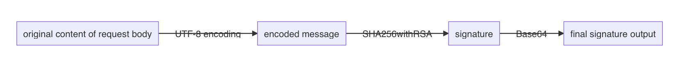
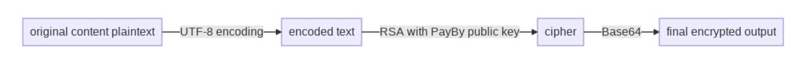

# Get Started

An overview of the process to start accepting payments using PayBy.

### **1. Know about PayBy products**

Start by understanding what products you can integrate to meet your needs. We provide a variety of payment products to suit different payment scenarios, including online payment, offline payment, web payment and mobile payment, etc.

You can view the Product Introduction to learn more about the products , and visit the developer documentation to know the access requirements.

 

### **2. Create a test account and apply to the payment product**

You need to create a test merchant and apply for the products you need to use in the test environment.

Create test merchant https://uat-web-merchant.test2pay.com/

Apply a product https://uat-web-merchant.test2pay.com/products/all-products

We will process your application as soon as we receive it on weekdays. If you have special needs, please contact [merchant@payby.com](mailto:merchant@payby.com) directly.

 

### 3. Configure the API key

After the account is activated, you need to download PayBy's public key and upload your own public key

Configuration: https://uat-web-merchant.test2pay.com/management/api-key

 

PayBy uses asymmetric encryption to verify signatures. Asymmetric cryptography, or public-key cryptography, is a cryptographic system that uses pairs of keys. Each pair consists of a public key (which may be known to others) and a private key (which may not be known by anyone except the owner).

 

**Merchant Public Key**

The merchant generates a key pair, the private key is stored by the merchant, and the public key should be uploaded to the PayBy system. The merchant needs to sign the request with its own private key when the merchant sends a request to PayBy, and PayBy uses the merchant's public key to verify the signature. If the verification is passed, it proves that the request was sent by the merchant and not faked by others.

The merchant can directly generate a key pair on PayBy portal. The public key will be automatically saved in the PayBy system and the private key can be downloaded. The merchant should save the private key carefully. If your private key is lost, please update the key in PayBy in time. The merchant can also generate with other OPENSSL tools.

 

**PayBy Public Key**

PayBy generates a key pair for each merchant, the private key is saved by PayBy and the public key is available on the portal for merchants to download. When PayBy sends response, PayBy will use its own private key to sign the message, and the merchant uses PayBy 's public key to verify the signature. If the verification is passed, it proves that the response was sent by PayBy and not faked by others.

 

**IP Whitelist**

When the merchant calls the API, PayBy only allows requests from the whitelist to go through. IP whitelist is required to set, otherwise an error will be reported when API is called. One or more whitelist IPs can be set. If you want to allow any IP to pass through, you can fill in *.

 

### **4. Verify in the test environment**

#### **Sign a request**

The preferred signature algorithm is SHA256withRSA, an efficient asymmetric encryption method. This algorithm first calculates a unique hash of the input data using SHA256 algorithm. The hash is then encrypted with a private key using the RSA algorithm.

Merchants would need to generate a pair of private key and public key from OPENSSL. Once the key pair is generated, the merchant's public key needs be shared with PayBy so that the sent messages can be validated by PayBy. So should they obtain PayBy's public key for furture use cases.

When the merchant is ready to send the API request, they should sign the request message with the merchant's private key.

When encryption is needed per API requirement, the merchant should encrypt the message with PayBy's public key so that PayBy can decrypt with their private key.

In order that all messages to be properly verified and decrypted, the request messages need to be encoded and decrypted using the same algorithm. Therefore, we require all requests to follow the following diagram when generating signatures.

Step 1: The entire request body should be processed as a signature.

Step 2: Use UTF-8 to encode the original message.

Step 3: Generate SHA256withRSA signature.

Step 4: Use Base64 to encode the signature generated in step 3.

Step 5: Use the signature generated in step 4 for all requests in the HTTP Header.

Sometimes it is necessary to encrypt the request payload or fields to prevent man-in-the-middle attacks. When encrypting, the encryption algorithm is chosen to encrypt with RSA using PayBy's public key. Note that the encrypted field should not be too large, usually no more than 200 bytes, in order to decrypt it in time.

The encryption encoding should follow this process:

 

If the request is sent successfully, PayBy will return response: the  `applystatus` = `success` and `code` = `0`.

 

Try to make a request call to verify whether your configuration is successful. If the calling fails and the reason cannot be found, you can contact [merchant@payby.com](mailto:merchant@payby.com), and we will arrange technical team to help you solve the problem.

 

#### **Request header format**

---

When sending a request to PayBy, the request content includes **Http Header** and **Http Body**. In most requests, the **Http Header** should be the same, as follows:

 

**Content-Language**    String 

The language in which the response message will be used, currently only English is supported.

Example value: en

Maximum length: `10`

 

**Content-Type**    String  Required

The media type. Required for operations with a request body. The value is `application/<format>`, where `format` is `json`.

Example value: application/json

 

**sign**   String   Required

Requests should be signed using private-key cryptography. This allows the payment gateway to verify that an incoming request is really from your application.

 

**Partner-Id**   String    Required

The merchant id of your account. 

Example value: 200001200101

Maximum length: `12`

 

#### Response header format

---

When PayBy sends response to you, the respons content includes **Http Header** and **Http Body**. In most responses, the **Http Header** should be the same, as follows

 

**sign**   String   Required

When PayBy sends response, PayBy will use its own private key to sign the message, and the merchant uses PayBy 's public key to verify the signature. If the verification is passed, it proves that the response was sent by PayBy and not faked by others.

 

#### Head of response body format

---

When PayBy sends response to you, the respons content includes **Http Header** and **Http Body**. The **Http Body** consists **head** and **body**. In most responses, the **Body** should be the same, as follows:

 

**applyStatus**   Enum    Required

The result of the request. The possible values are:

`SUCCESS `- Application successful. 
`FAIL` - Application failed. Check the `code`  and `msg` for exact reason. 
`ERROR` - Application error. The signature verification failed. Please check whether the private key used for the signature and the public key uploaded on the PayBy portal are one key pair.

 

**code**   String    Required

Response Codes. View the [resconse codes](#response code) section to know all the possible results.

Example value: 0

 

**msg**   String   

Description of this code. View the [resconse codes](#response code) section to know all the possible results.

 

**traceCode**   String   

No special meaning, PayBy internally used to locate the error.

 

### 5. Build your integration

Choose your integration to match your business needs in the menu:

**Checkout**: Hosted paypage, iFrame paypage, In-App SDK

**Special payment scenes**: E-wallet, DYNQR, QRPAY, JSAPI, Direct pay

**E-commerce plugin**: Magento plugin, Opencart plugin, WooCommerce plugin

**Fundout**: Transfer, Transfer to bank

 

### **6. Get ready to go live**

If you have successfully verified in the test environment and prepare to launch in live environment, follow the steps as you have done in the test environment.

- Apply for production environment account: https://b.payby.com/
- Enable production environment products: Contact our sales to decide the procucts and rates bd@payby.com
- Configure production environment key: https://b.payby.com/management/api-key
