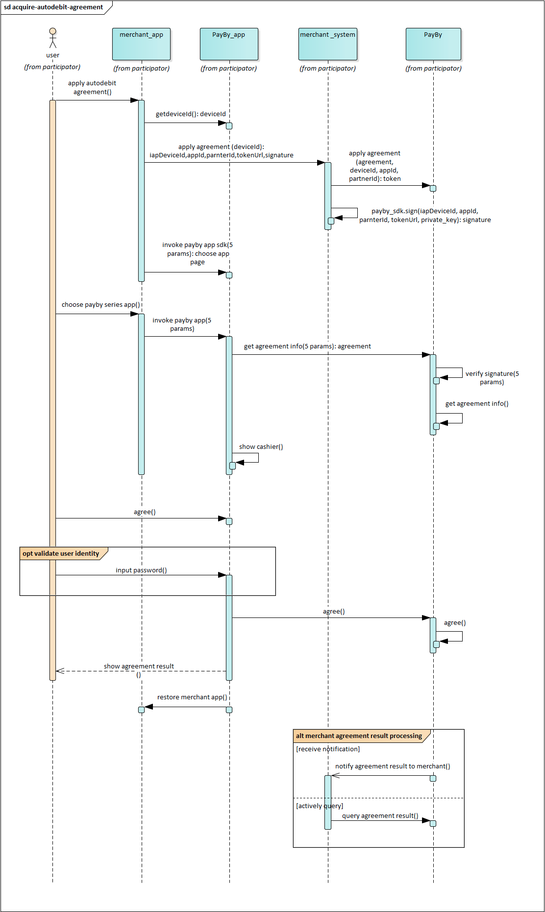

# Auto Debit

This product is suitable for recurring payment. After the customer agrees to the agreement, the merchant can call the API to automatically deduct the funds from the user's PayBy account. Since signing agreement is done within the app, it is required that your customers have already installed the PayBy app.

 

### User experience

1. The customer agrees that the merchant can automatically debit from the PayBy account, in the merchant's app.
2. The customer is redirected to PayBy app to sign the auto debit agreement and then backs to the merchant's app. 
3. When the customer needs to pay, the merchant can directly deduct funds from the customer's payby account. The customer will receive an in-app message notification or SMS notification.

 

### Integrate the API

#### Step1: Customer signs the agreement

The merchant app collects all the parameters needed to sign the agreement and the merchant's server call the [Apply Protocal](/docs/applyprot) API.

If the request is successful, PayBy will return the **tokenUrl**. The merchant's server needs to convert the URL into an QRcode image and display it to customers on its interface. 

 

#### Step2: Deduct funds

