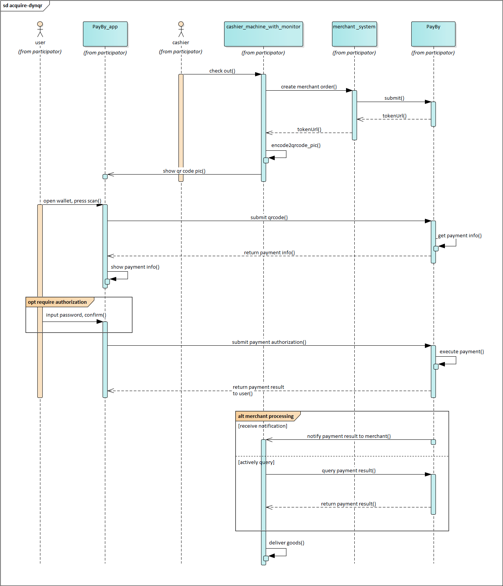

# DYNRQ (Merchant presented QR code)

After the customer places an order, a dynamic code is generated on the interface, and the customer can scan the code by PayBy , BOTIM APP to complete the payment. 

Some interfaces are not suitable for customers to enter card information, such as vending machines or parking garages, this method can effectively transfer the payment process from the merchant interface to the user's mobile phone. Making payments via QR codes is very secure. It’s because the QR code is nothing but just a tool that is used to exchange information. Any data which is transferred via QR codes is encrypted thus making the payment foolproof secure.

 

### User experience

1.  The customer confirms to pay for an order, the merchant generates a QR codes on the interface.

2. The customer uses PayBy, BOTIM to scan the QR code to obtain order information. 

3. In the order information returned by payby server, there is a parameter **tokenUrl**, PayBy or BOTIM application will parse this parameter and redirect the customer to the built-in checkout of the app.

4. Customers enter their payment details on the payment page and complete the transaction.

5. If the payment is completed, the customer will see the payment result on the app.

   

 

### Integrate the API

When the customer confirms to pay, call the [Create order](/docs/createorder) API,  follow the API description to create a reuest. Pass `DYNQR` in the **paysceneCode** parameter. 

If the request is successful, PayBy will return the **tokenUrl**. The merchant's server needs to convert the URL into an QRcode image and display it to customers on its interface. 

After the payment the payby server will notify the result to PayBy or BOTIM app, and the customer will see the payment result on the app. 

If the **notify_url** is set in the order creation request, after the transaction, PayBy will send payment result to the url. 

To retrieve the order deatail, call the [Retrieve Order Detail](/docs/retrieveorderdetail) API. 

 

