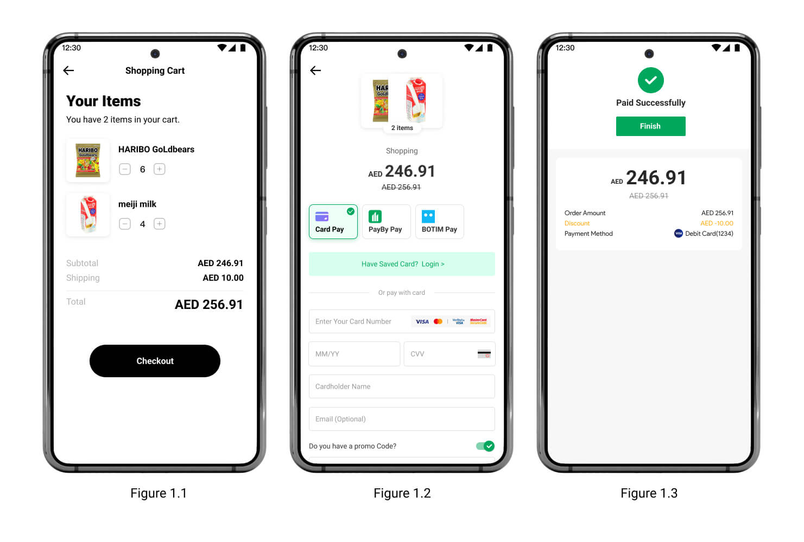

# Hosted paypage

Hosted paypage is one of the most common and easiest ways to acquire payments. It is payby's preset checkout interface, which integrates all the payment channels you need. When customers pay, they will be redirected from your website to a payment page which is hosted on PayBy servers.

 

### User experience

1. The customers are ready to complete their payment, your application creates a new order creation request.
2. The PayBy returns a URL that redirects customers to a hosted payment page.
3. Customers choose a payment method and enter their payment details on the payment page to complete the transaction.
4. If the payment is completed, customers will be redirected to the merchant's success page. 

 

### Integrate the API

#### Create Order

When the customer confirms to pay, call the [Create order](/docs/createorder) API,  follow the API description to create a reuest. Pass `PAYPAGE` in the **paySceneCode** parameter. 

If the request is successful, PayBy will return the **tokenUrl**, redirect your customer to the URL for the Checkout page returned in the response. 

 

Create a success page for the URL you provided in the **redirectUrl**  parameter to display order confirmation message to your customer. PayBy will redirect the payer to this page after the payment has been completed on the checkout. 

 

#### Asynchronous notification

If the **notifyUrl** is set in the order creation request, after the transaction, PayBy will send payment result to the url. 

 

#### Change Order Status

You can initiate [Revoke](/docs/revoke), [Cancel](/docs/cancel), [Refund](/docs/refund) and other operations on the created order.

 

#### Retrieve Order

To retrieve the order detail, call the [Retrieve Order Detail](/docs/retrieveorderdetail) API.

 

### Customize paypage UI

You can customize the appearance of the hosted checkout page by adding your logo and color in the Dashboard’s [Customize Checkout](https://b.payby.com/customize-checkout).

 

### Set payment method
On the paypage page, by default all the payment methods that merchants have activated in PayBy will be listed. If you need to adjust the order of payment methods that your customers see, or temporarily set some payment methods as unavailable to the payer, please configure it in [Payment Methods](https://b.payby.com/payment-methods).

 

