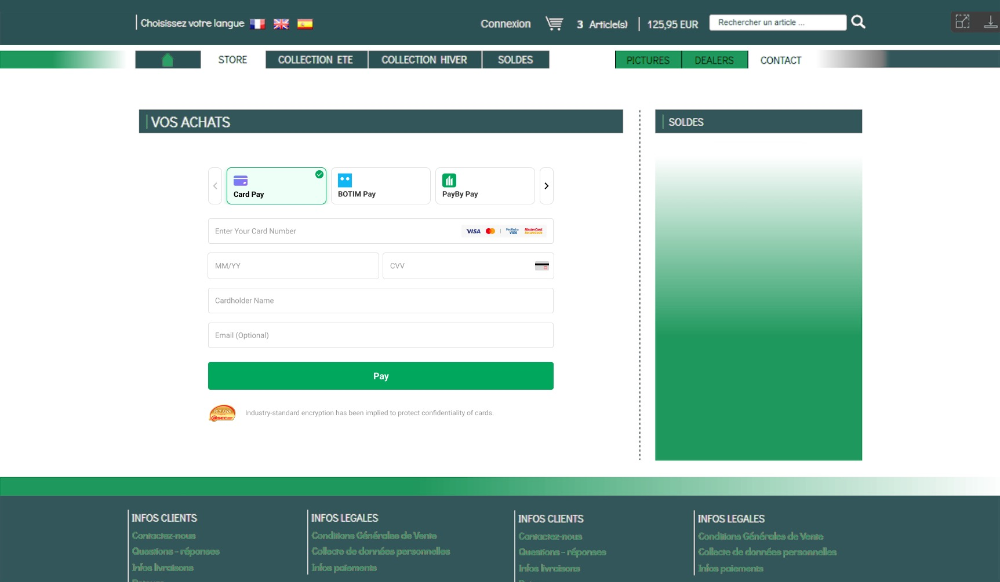

# iFrame paypage

iFrame Payment Page is a website prepared by PayBy and can be embedded in your website. The Hosted Pay Page still resides on PayBy’ secure servers but the transition to the PayBy secure page is invisible to the cardholder.<br/>
Unlike the hosted paypage, using iFrame payapge will not go out of your website when customer pays, which can reduce the failure rate of payment. At the same time, integrating it on its own page will provide you more flexibility.

<br/>

### User experience

1. When customers are ready to complete their payment, your application creates a new order creation request.
2. The PayBy returns a URL that can be rendered in the container on your checkout page.
3. Customers choose a payment method and enter their payment details on the payment page to complete the transaction.
4. If the payment is completed, customers will be redirected to the merchant's success page.<br/>




<br/>

### Integrate the API

#### Load PayBy JS SDK

```
<script async src="https://checkout.payby.com/sdk/payby-sdk.umd.js"></script>
```


#### Get tokenUrl

When the customer confirms to pay, call the [Create order](/docs/createorder) API,  follow the API description to create a reuest. Pass `PAYPAGE` in the **paySceneCode** parameter.<br/>If the request is successful, PayBy will return a token url that can be rendered in the container on your checkout page.


#### Create an iFrame

Use PayBy.createiFrame with tokenUrl to create an iFrame within a predefined div element.

```
PayBy.createiFrame({
  id: 'container',
  lang: 'ar',
  tokenUrl: tokenUrl,
  error: function (msg) {
   alert(msg); 
  }
 }
```

---

**id**   <font color = ' #7d8793'>String</font>    <font color = '#f19938'>Required</font>

Define the id of the page element contained in the iFrame. You can name the id any character that you can recognize.

Example value: container

Max length: `200`

<br/>

**lang**   <font color = ' #7d8793'>String</font>

The default language of the page PayBy returned in the `tokenUrl`. 

Currently only Arabic and English are supported. If no value is passed, or value other than the below two is passed, the page's defaults language will be English.

Example value: 

`ar`. Arabic

`en`. English

<br/>

**tokenUrl**   <font color = ' #7d8793'>String</font>    <font color = '#f19938'>Required</font>

Link of the paypage, whichcan be rendered in the container on your checkout page.

<br/>

**success**  <font color = ' #7d8793'>String</font>  

The parameter is deprecated. 

<br/>

**error**  <font color = ' #7d8793'>Function</font>  

When the iFrame processes failed payment, the merchant's website needs to prompt the user with an error message. Please refer to the content of the parameter `msg` in PayBy's response to understand the specific error message.

---

<br/>

#### Redirect URL

Create a success page for the URL you provided in the **redirectUrl**  parameter to display order confirmation message to your customer. PayBy will redirect the payer to this page after the payment has been completed on the checkout.

<br/>


#### Asynchronous notification

If the **notifyUrl** is set in the order creation request, after the transaction, PayBy will send payment result to the url.<br/>

<br/>

#### Change Order Status

You can initiate [Revoke](/docs/revoke), [Cancel](/docs/cancel), [Refund](/docs/refund) and other operations on the created order.

<br/>

#### Retrieve order detail

To retrieve the order detail, call the [Retrieve Order Detail](/docs/retrieveorderdetail) API.

<br/>


### Set payment method

On the paypage page, by default all the payment methods that merchants have activated in PayBy will be listed. If you need to adjust the order of payment methods that your customers see, or temporarily set some payment methods as unavailable to the payer, please configure it in [Payment Methods](https://b.payby.com/payment-methods).

<br/>


