# Magento plugin

PayBy offers various plugins that enable you to accept payments on your ecommerce website via the PayBy Payment Gateway. You can accept payments via debit card, credit card, netbanking (supports 3D Secure) or through any of our supported wallets.
<br/>

You can use the plugins for a seamless integration. This not only allows for refunds and chargebacks but also enables the plugin to works across all browsers.

<br/>

### Product Application

Step 1:Create your account in the PayBy Merchant Portal.

| Environment                 | URL                                                       |
| ---------------------- | ------------------------------------------------------------ |
| Production      | https://b.payby.com |
| UAT      | https://uat-web-merchant.test2pay.com/ |

<br/>

Step 2:Visit the Product List to see the product named **Basic Payment Gateway** and click APPLY NOW.

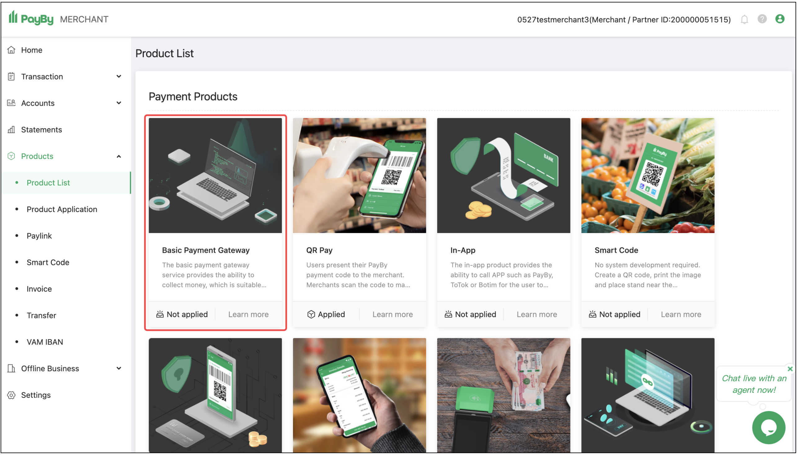
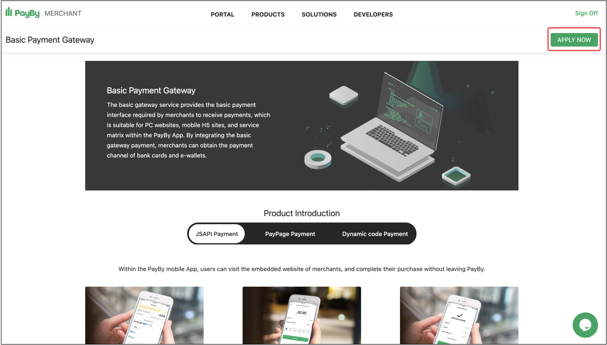
<br/> 
Step 3:Enter the merchant information and submit the application.

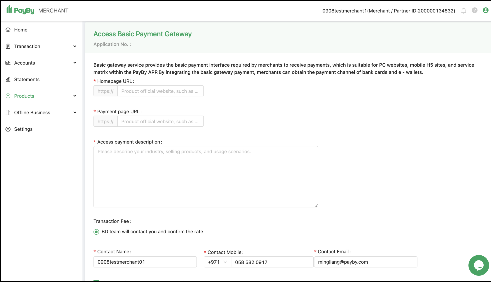
<br/> 
Step 4:Once the application is submitted, it will be reviewed by the PayBy team. This usually takes 1-2 working days.
<br/>   

### Generate the API keys from the PayBy Merchant Portal
After submitting your product activation request, please visit the API Management of the merchant portal to configure the basic parameters required for the integration.

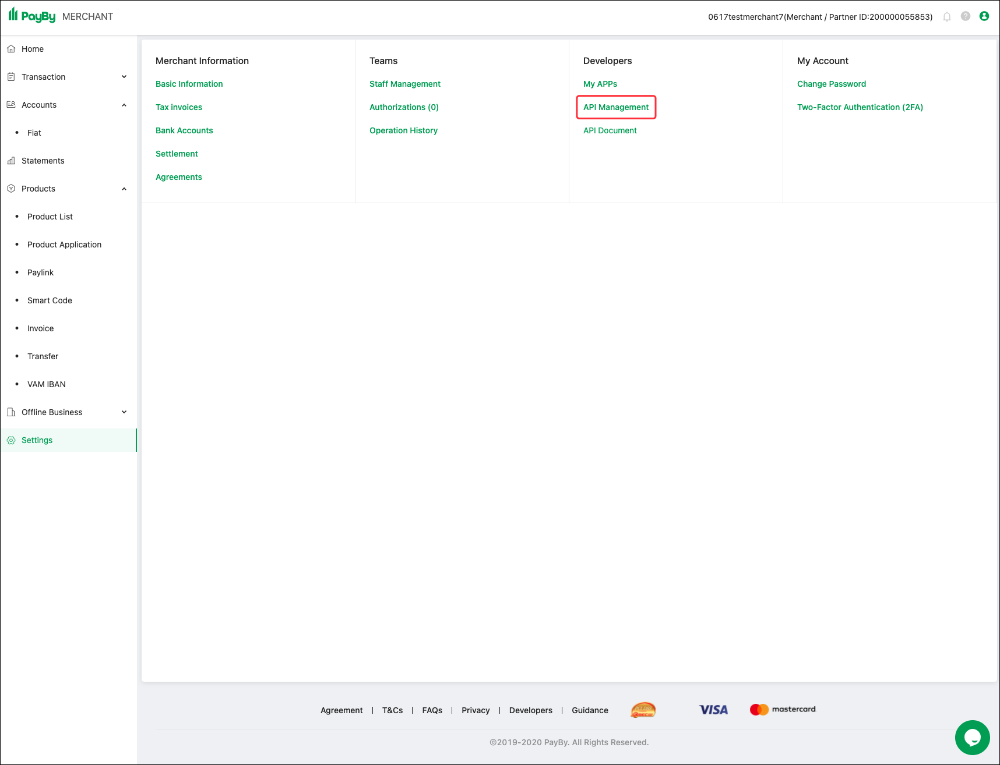

<br/>

**Step 1: Generating the security keys**

```shell
### Generate private key
# PayBy_key.pem Private key file name
# 2048 Private key size, at least 2048
openssl genrsa -out PayBy_key.pem 2048

### Export public key
# PayBy_key.pem Private key generated in the previous step # PayBy_key_public.pem Exported public key name
openssl rsa -in PayBy_key.pem -out PayBy_key_public.pem -pubout

### Export private key for Java
# PayBy_key.pem Private key generated in the 1st step
# PayBy_key_Private.pem
openssl pkcs8 -in PayBy_key.pem -topk8 -nocrypt -out PayBy_key_private.pem
```

<br/>

**Step 2: Upload your public key**

Upload "PayBy_key_public.pem" on this step. This pem is used to signiture the request from merchant.

<br/>

**Step 3: Download PayBy Public Key**

This pem is used to Verify the response from PayBy and Encrypting senitive information.

[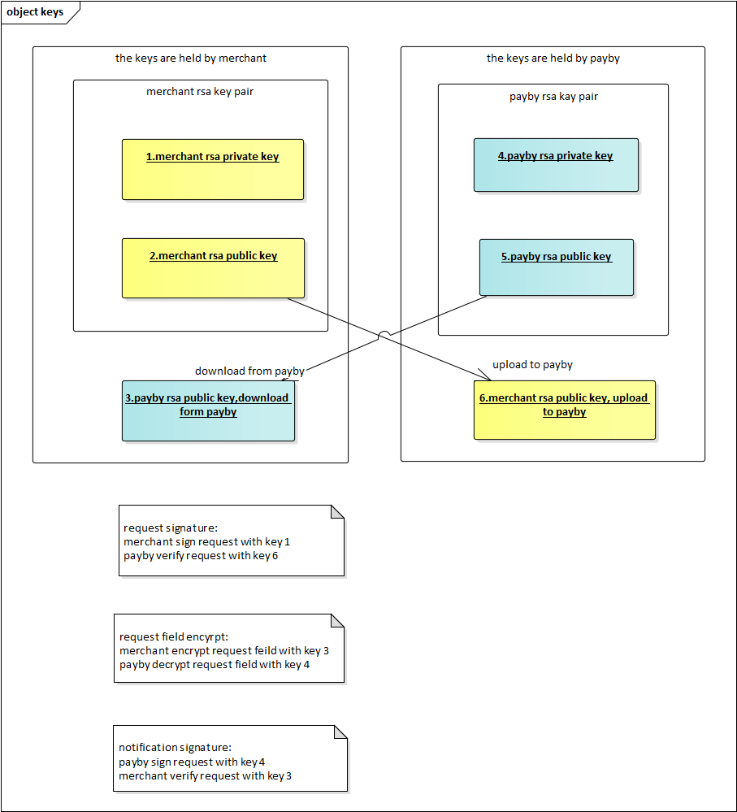](https://mermaid-js.github.io/mermaid-live-editor/#/edit/eyJjb2RlIjoiICAgIGdyYXBoIExSXG4gICAgICAgIEFbXCJvcmlnaW5hbCBjb250ZW50IG9mIHJlcXVlc3QgYm9keVwiXSAtLSBVVEYtOCBlbmNvZGluZyAtLT5CW1wiZW5jb2RlZCBtZXNzYWdlXCJdIC0tIFNIQTI1NndpdGhSU0EgLS0-Q1tcInNpZ25hdHVyZVwiXSAtLSBCYXNlNjQgLS0-IERbXCJmaW5hbCBzaWduYXR1cmUgb3V0cHV0XCJdXG4iLCJtZXJtYWlkIjp7InRoZW1lIjoiZGVmYXVsdCIsInNlcXVlbmNlIjp7ImRpYWdyYW1NYXJnaW5YIjo1MCwiZGlhZ3JhbU1hcmdpblkiOjEwLCJhY3Rvck1hcmdpbiI6NTAsIndpZHRoIjo0MDAsImhlaWdodCI6NjUsImJveE1hcmdpbiI6MTAsImJveFRleHRNYXJnaW4iOjUsIm5vdGVNYXJnaW4iOjEwLCJtZXNzYWdlTWFyZ2luIjozNSwibWlycm9yQWN0b3JzIjp0cnVlLCJib3R0b21NYXJnaW5BZGoiOjEsInVzZU1heFdpZHRoIjp0cnVlLCJyaWdodEFuZ2xlcyI6ZmFsc2UsInNob3dTZXF1ZW5jZU51bWJlcnMiOmZhbHNlfX0sInVwZGF0ZUVkaXRvciI6ZmFsc2V9)

<br/>

**Step 4: Bind IP address (Required)**

This IP address is outbound IP of Merchant system. PayBy provides you with a strong API through which you can enjoy services such as placeOrder, getOrder, etc. View How To Use via Developers website.
For security reasons, we recommend that API should bind at least one IP address.
If there is only one IP address, you can enter it directly. If there is more than one IP address, you should separate them with halfwidth comma (e.g. 192.168.1.1,192.168.1.2,192.168.1.3) or Replace with *
(e.g. 192.168.*.*,172.16.9.*,192.168.1.1). If you want to allow any ip addresses,you can only enter *."

<br/>

### Integration Steps

**Step 1:Download**

2.2.x version
https://github.com/PayBy/Extenstions/blob/master/payby_magento2.2.x-payment-gateway_2.0.1_updated.zip 

2.3.x version
https://github.com/PayBy/Extenstions/blob/master/payby_magento-payment-gateway_2.0.1.zip

<br/>

**Step 2:Install Plugin**

1. Set the payment currency to AED – United Arab Emirates Dirham.

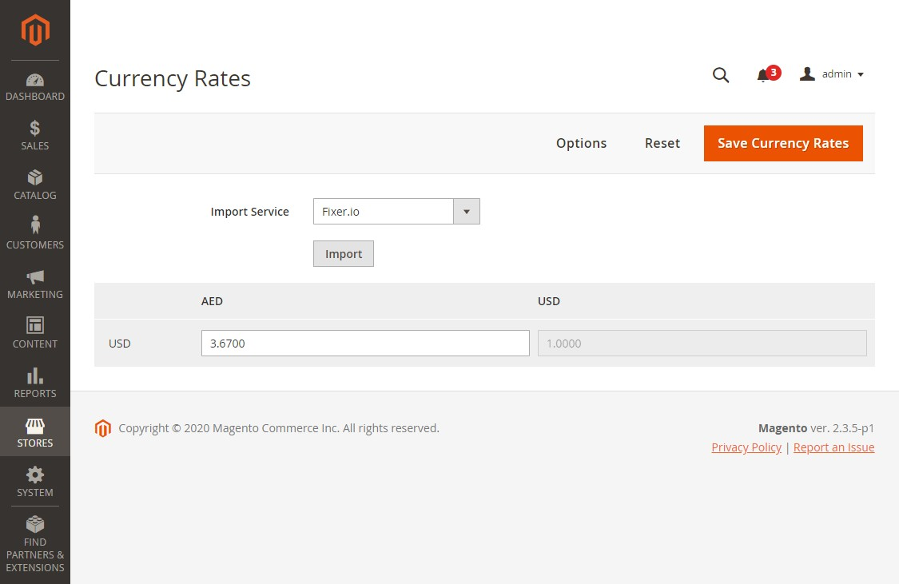  

2. Set up the Magento.  
3. Upload the compressed files called 'payby_magento-payment-gateway.zip' to Magento’s server.  
4. Unzip "payby_magento-payment-gateway.zip" to sub folder app/code that you would get folder structure similar to following:  

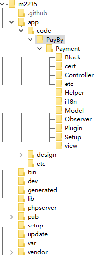  

5. Login Magento server with your favorite SSH client e.g. putty, and entered Magento’s root folder. Run following command one by one:  

```php
php bin/magento module:enable PayBy_Payment php bin/magento setup:upgrade
php bin/magento setup:di:compile
php bin/magento setup:static-content:deploy php bin/magento cache:clean`
```

<br/>

**Step 3:Configure Magento**

1. Navigate to Stores → Configuration → Sales → Payment Methods → PayBy  
2. Enter the Merchant Partner Id provided. 
3. Enter the Merchant Private Key provided. 
4. Enter the PayBy Public Key provided. 
5. Select Mode Test for testing, Production for generalusage.   
6. Confirm that the currency is set to AED.
7. Click on Save Config to update the settings.

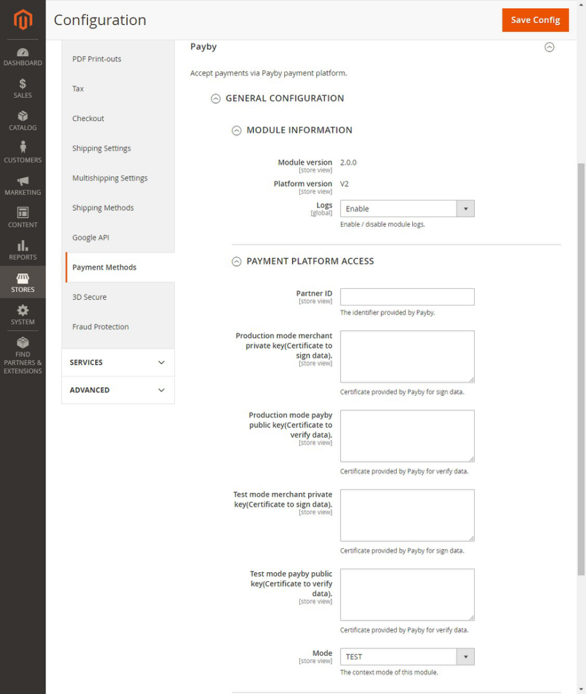  


**Step 4:Check front checkout page**

1: Select PayBy as the payment method and place the order.

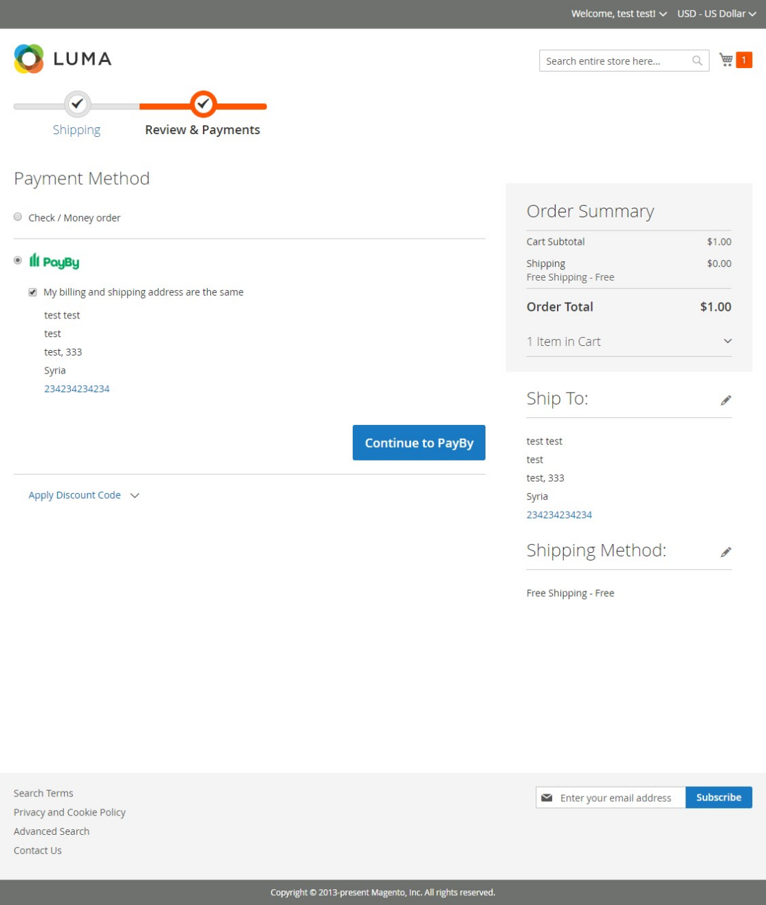  

<br/>

2: The page will be redirected to the PayPage, choose to pay by SCAN PAY or CARD PAY.<br/>
Option A:

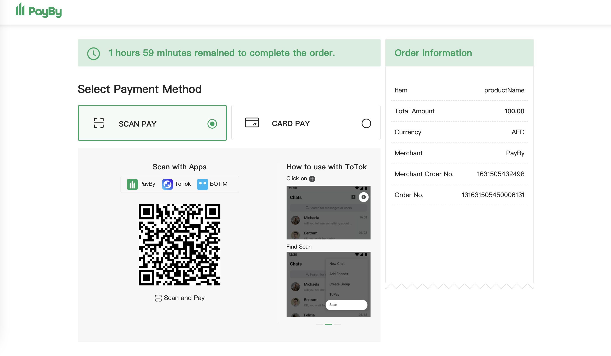  
Option B: 

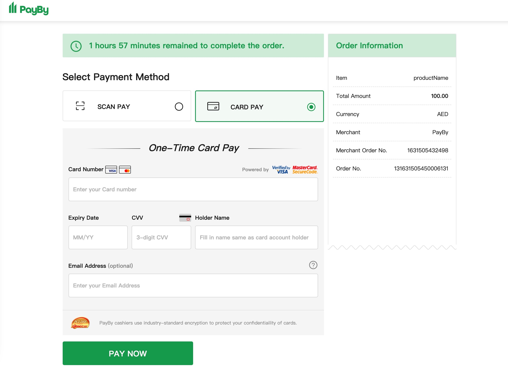  

<br/>

3: Check the payment results.