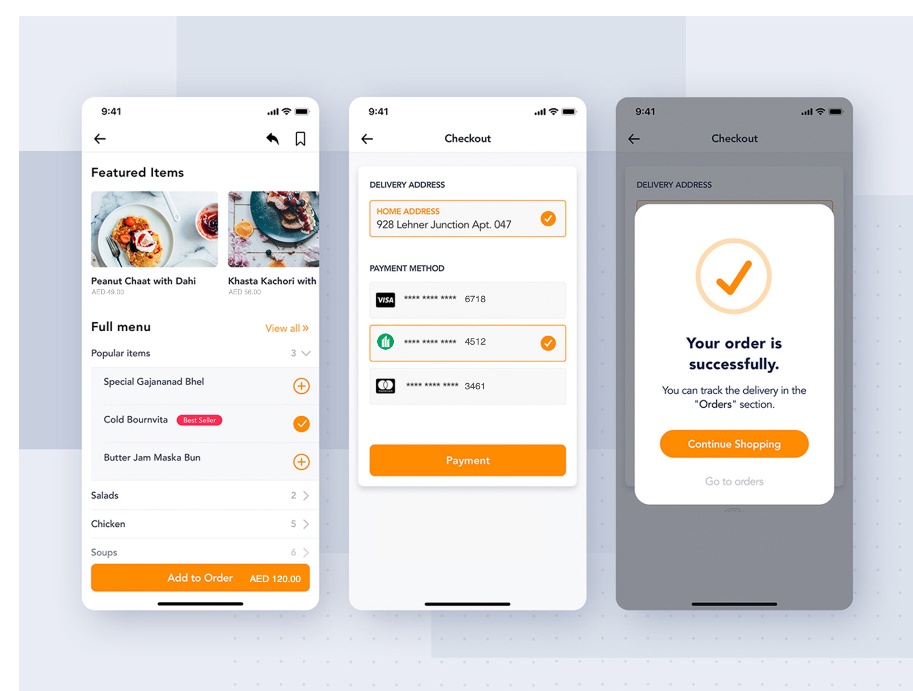
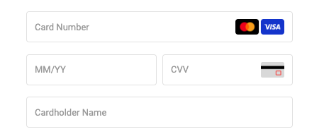
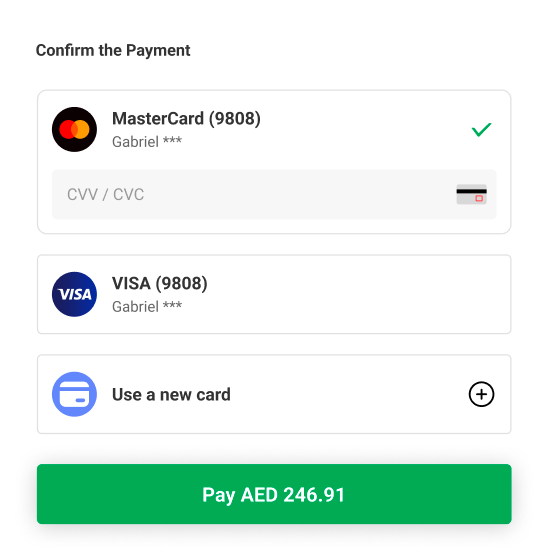

# Direct Pay

PayBy provides API for card transactions for merchants to integrate, customers fill in card information on the merchant's page to complete the payment. The card information is encrypted and stored in PayBy and customers can pay by one click next time. This product provides merchants with a more flexible integration method and merchants can have full control of the UI elements.

 

### User experience

1. The customer confirms to pay for an order on the merchant's website or app.
2. If the customer is a new payer, he or she enters the card detail (Name, Card Number, CVV) to finish payment. If the customer has paid before and the merchant has stored the card details, just select the stored card and finish payment.
3. If the payment is completed, the customer will see the payment result on the merchant's website or app.

 

### Integrate the API

#### Case1: New payer

 If the customer is a new payer, when the customer confirms to pay, show the **Bank card number**, **Expire date**, **Cardholdername**, **CVV**, etc. input boxes on your page. 

When the customer confirms to pay, call the [Create order](/docs/createorder) API,  follow the API description to create a request. Pass `DIRECTPAY` in the **paySceneCode** parameter. 

 

If the request is successful, PayBy will proceed the request to bank and return the payment result to the customer. Create a success page for the URL you provided in the **redirectUrl**  parameter to display order confirmation message to your customer. PayBy will redirect the payer to this page after the payment has been completed on the checkout. 

 

Usually, the payment can be completed after the user enters the card information, but sometimes the user is required to submit a 3DS verification. In this process, PayBy will return you a URL, and you direct the customer to an authentication page on their bank’s website, and the customer enters a password associated with the card or a code sent to their phone. After successful verification, the transaction proceeds.

 

If you feel that the customer's transaction requires a higher level of verification, you can actively initiate 3DS verification.The **threeDSecure** parameter is for the merchant to decide whether the transaction requires 3DS verification. If true, PayBy will return the verification link; if false, PayBy will debit the payment directly after submitting the payment request. The default is False. Note that, if PayBy's risk control system identifies that the transaction requires 3DS verification, even if the merchant passes false, the payer will be required for 3DS verification.

 

The payer's card information can be saved for future use. In the parameter **saveCard**, if pass true, PayBy will return the ID of the card, so that the card ID can be passed directly instead of the card information when another transaction is made. A customer id can save multiple cards in PayBy.

 

If the **notifyUrl** is set in the order creation request, after the transaction, PayBy will send payment result to the url. 

 

To change order status, you can initiate [Revoke](/docs/revoke), [Cancel](/docs/cancel), [Refund](/docs/refund) and other operations on the created order.

 

To retrieve the order detail, call the [Retrieve Order Detail](/docs/retrieveorderdetail) API. 

 

#### Case2: Use saved card

If the customer has paid before and the merchant has stored the card details, he or she can select the stored card and finish payment.

When the customer confirms to pay, call the [Create order](/docs/createorder) API,  follow the API description to create a request. Pass `DIRECTPAY` in the **paySceneCode** parameter.

 

When the customer's card is successfully saved in PayBy, PayBy will return the **cardToken**,  the unique identification number in PayBy. After the customer selects a card, pass this card's token in the **cardToken** parameter. 

 

To change order status, you can initiate [Revoke](/docs/revoke), [Cancel](/docs/cancel), [Refund](/docs/refund) and other operations on the created order.

 

If the **notifyUrl** is set in the order creation request, after the transaction, PayBy will send payment result to the url.

 

To retrieve the order detail, call the [Retrieve Order Detail](/docs/retrieveorderdetail) API.

 

