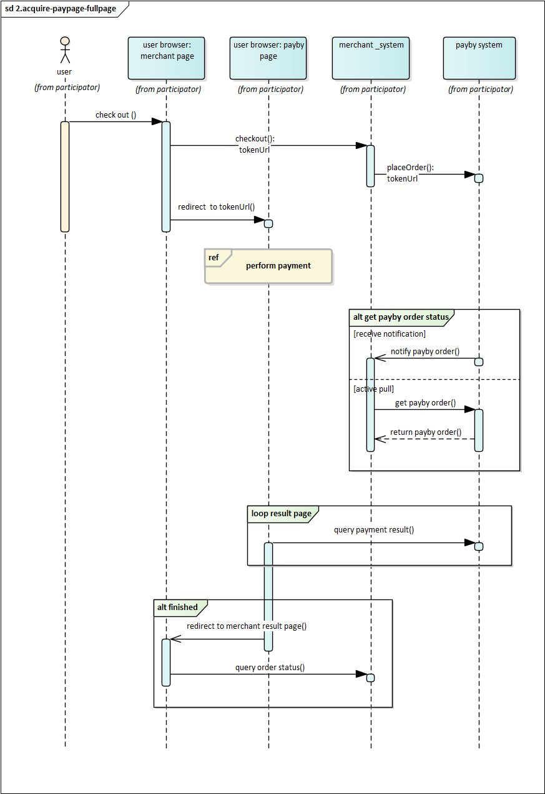

# E-wallet

Put one or more E-wallet  icons that we supported on your mobile application's checkout. After your customer selects one, he or she will be redirected to that E-wallet app to finish the payment. Currently our supported wallets are BOTIM and PayBy APP.

 

### User experience

1. When customers are ready to complete their payment, your application creates a new order creation request.
2. The PayBy returns a URL that your APP can revoke the Ewallet's checkout through deeplink method.
3. Customers enter their payment details on the payment page and complete the transaction.
4. If the payment is completed, customers will be redirected to the merchant's success page. 

 

### Integrate the API

#### Create order

When the customer confirms to pay, render the ewallet list for the customer to choose. Which wallets and order of wallets the customers see is determined by the merchant and stored in the merchant's server. When customers initiate payments, the merchant app query from the merchant's server. 

Call the [Create order](/docs/createorder) API,  follow the API description to create a reuest. Pass `EWALLET` in the **paySceneCode** parameter. 

If the request is successful, PayBy will return a deeplink to redirect the customer to the target ewallet. 

Create a success page for the URL you provided in the **redirectUrl**  parameter to display order confirmation message to your customer. PayBy will redirect the payer to this page after the payment has been completed on the checkout.

 

#### Asynchronous notification

If the **notifyUrl** is set in the order creation request, after the transaction, PayBy will send payment result to the url. 

 

#### Change Order Status

You can initiate [Revoke](/docs/revoke), [Cancel](/docs/cancel), [Refund](/docs/refund) and other operations on the created order.

 

#### Retrieve Order

To retrieve the order detail, call the [Retrieve Order Detail](/docs/retrieveorderdetail) API.

 

