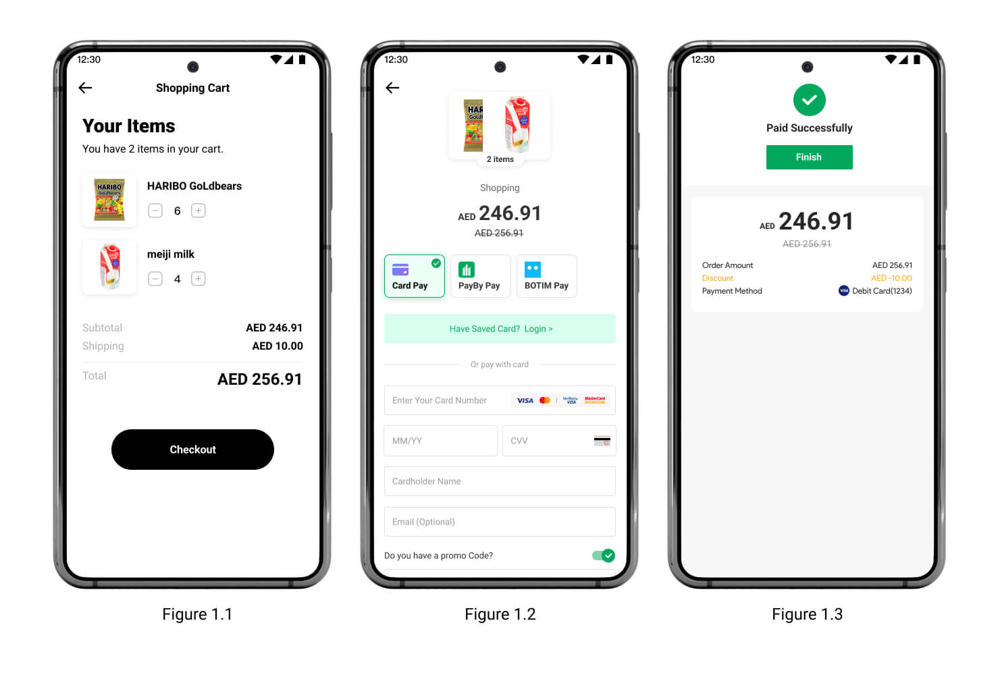
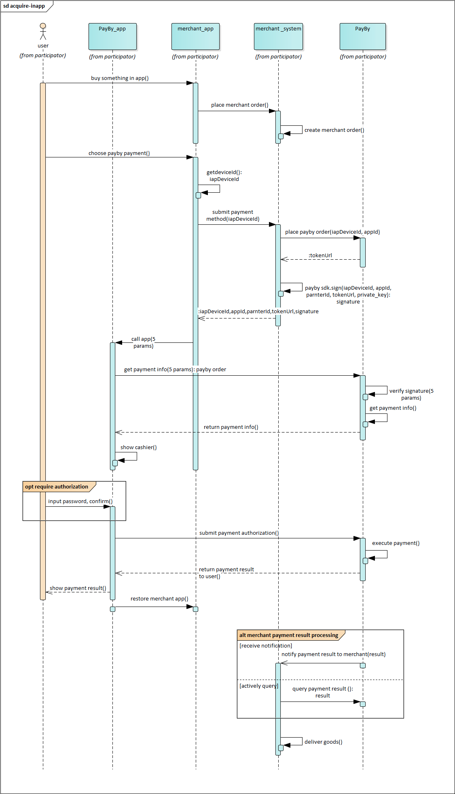

# In-App SDK - iOS

Payers will have the almost the same operation process for using **In-APP** and **Paypage**. The difference is that if the mobile client integrates the sdk, users will get a smoother experience when paying on the native page than a web page.

<br/>

### User experience

1. When customers are ready to complete their payment, your mobile application creates a new order creation request.
2. The PayBy returns a URL that that redirects customers to a checkout.
3. Customers enter their payment details on the checkout and complete the transaction.
4. If the payment is completed, customers will be redirected to the merchant's success page.<br/>



### System interaction diagram



<br/>

### SDK

[Link](https://github.com/PayBy/PayBy-inApp-iOS)

<br/>

### Term Definition

- deviceId: Every device has its own unique deviceId. UAT environment [joint debugging] fixed: deviceId123
- partnerId: Every merchant is assigned a partnerId while applying for the payment service
- appId: Every app of a merchant is assigned an appId while applying for the payment service
- token: It contains order information
- sign: First, generate a singString by arranging deviceId、partnerId、appId、token order. The rules are as follows: String signString = "iapAppId="+appId+"&iapDeviceId=" +deviceId+"&iapPartnerId="+partnerId+"&token="+token; Second, sign the signString with privateKey, and the encryption rules can be seen in the demo. Note: For demo purposes, the sign is generated on the app client. For security, the sign should be generated by the server and then returned to the client.

<br/>

### Applicable version

Use Xcode 10 and above to use the new version of SLDPayByPayment SDK, iOS 10.0 and above

<br/>

### Installation

#### Installation with CocoaPods

[1] Build your project in XCode.

<br/>

[2] To integrate SLDPayByPayment into your Xcode project using CocoaPods, specify it in your Podfile：<br/>

```
pod 'PXRPPayByPayment'
```

Save and execute `pod install`, then open the project with a file with the suffix .xcworkspace. Note: If you are using `SLDPayByPayment` now, please replace it with `PXRPPayByPayment`, run `pod install` to install, and then the new `SLDPayByPayment.framework` will be integrated into you project. `SLDPayByPayment` pod doesn't been maintained any more.

<br/>

[3] In Xcode, select your project settings, select the "TARGETS" column, and add "URL scheme" to the "URL Types" in the "Info" tab bar for your registered application "payby" + iapAppId (As shown). [](https://github.com/PayBy/PayBy-inApp-iOS/blob/master/1661319255013.jpg)

<br/>

[4] In Xcode, select your project settings, select the "TARGETS" column, and change "Architectures" to "arm64" in the "Build Settings" tab (As shown). [](https://github.com/PayBy/PayBy-inApp-iOS/blob/master/1661244568047.jpg)

<br/>

[5] In Xcode, select your project settings, select the "TARGETS" column, and change "Enable Bitcode" to "No" in the "Build Settings" tab (As shown). [](https://github.com/PayBy/PayBy-inApp-iOS/blob/master/1661244707155.jpg)

<br/>

### Usage

#### Initialize SDK (Required)

```
#import "AppDelegate.h"
#import <SLDPayByPayment/SLDPayByPayment.h>

@implementation AppDelegate

- (BOOL)application:(UIApplication *)application didFinishLaunchingWithOptions:(NSDictionary *)launchOptions {
    // Override point for customization after application launch.
    [SLDPayByPaymentInterface setLogEnabled:YES];
    
//    [SLDPayByPaymentInterface setLanguage:SLDPayByPaymentLanguageEn];
//    [SLDPayByPaymentInterface setUserInterfaceStyle:SLDPayByPaymentUserInterfaceStyleDark];
//    SLDPayByPaymentConfig *config = [SLDPayByPaymentConfig defaultConfig];
//    config.paymentMethodMenuColor = [SLDPayByPaymentColor colorWithLightColor:[UIColor redColor] darkColor:[UIColor greenColor]];
//    config.paymentMethodTextColor = [SLDPayByPaymentColor colorWithLightColor:[UIColor whiteColor] darkColor:[UIColor blackColor]];
//    config.primaryColor = [SLDPayByPaymentColor colorWithLightColor:[UIColor blueColor] darkColor:[UIColor blueColor]];
//    config.appPayUseQrCode = NO;
//    config.useDefaultResultPage = YES;
//    [SLDPayByPaymentInterface updateConfig:config];

    [SLDPayByPaymentInterface initWithAppId:{appId} partnerId:{partnerId} environment:SLDPayByPaymentEnvironmentDevelop];

    ...

    return YES;
}

@end
```

<br/>

SLDPayByPaymentEnvironment Description:

- SLDPayByPaymentEnvironmentDevelop: The environment for developing and testing.
- SLDPayByPaymentEnvironmentUAT: The environment for customer debuging.
- SLDPayByPaymentEnvironmentRelease: The environment for product online.

<br/>

Call methods in your class (Objective-C)

```
NSString *sign = [NSString stringWithFormat:@"iapAppId=%@&iapDeviceId=%@&iapPartnerId=%@&token=%@", self.appIdTextField.text, self.deviceIdTextField.text, self.partnerIdTextField.text, self.tokenTextField.text];
[SLDPayByPaymentInterface paymentInViewController:self withToken:self.tokenTextField.text sign:[GPBRSA encryptString:sign privateKey:[GlobalDefines privateKey]] deviceId:self.deviceIdTextField.text resultCallback:^(NSString * _Nonnull result) {
    NSLog(@"resultCallback: %@", result);
    if ([SLDPayByPaymentConfig defaultConfig].useDefaultResultPage == NO) {
        [self showAlertWithMessage:result];
    }
}];
```

<br/>

Call methods in your class (Swift)

```
let token = self.tokenTextField.text ?? ""
let deviceId = self.deviceIdTextField.text ?? ""
let sign = "iapAppId=\(self.appIdTextField.text ?? "")&iapDeviceId=\(deviceId)&iapPartnerId=\(self.partnerIdTextField.text ?? "")&token=\(token)"
SLDPayByPaymentInterface.payment(in: self, withToken: token, sign: GPBRSA.encryptString(sign, privateKey: GlobalDefines.privateKey()), deviceId: deviceId) { [weak self] result in
    print("resultCallback: \(result)")
    if SLDPayByPaymentConfig.default().useDefaultResultPage == false {
        self?.showAlert(with: result)
    }
}
```

<br/>

#### Payment Result Code Description

- SUCCESS: The payee has received the payment successfully, and the entire payment process for the order is completed.
- FAIL: Payment failed.
- PAYING: Processing. Wait for the payment process to complete and return the final payment result.
